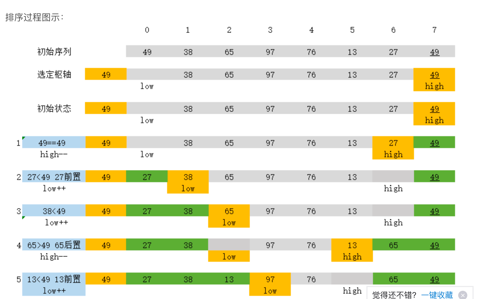

<h1 align=center>用GO实现经典排序算法</h1>

#  题目
    输入：nums = [5,2,3,1]，升序排序

## 冒泡排序（交换排序）
```
func BubbleSort(arr []int) []int {
	for j := 0; j < len(arr); j++ {
		for i := 1; i < len(arr)-j; i++ {
			if arr[i-1] > arr[i] {
				arr[i-1], arr[i] = arr[i], arr[i-1]
			}
		}
	}
	return arr
}
```

## 快速排序 （确定基准）

```
func QuicSort(arr []int) []int {
	if len(arr) <= 1 {
		return nil
	}
	// 确定基准
	p := arr[0]
	low := 0
	high := len(arr) - 1
	for low < high {
		for low < high && arr[high] >= p {
			high--
		}
		if low < high {
			arr[low] = arr[high]
			low++
		}
		for low < high && arr[low] <= p {
			low++
		}
		if low < high {
			arr[high] = arr[low]
			high--
		}
	}
	arr[low] = p
	QuicSort(arr[:low])
	QuicSort(arr[low+1:])
	return arr
}
```

## 堆排序
```
func HeapSort(arr []int) []int {
	// 建堆(小元素下沉) > 堆头和堆底交换 > 小元素下沉 > 堆头和堆底交换 > 小元素下沉
	BuildHeap(arr)
	for i := len(arr) - 1; i > 0; i-- {
		arr[i], arr[0] = arr[0], arr[i]
		MinDown(arr, 0, i-1)
	}
	return arr
}
func BuildHeap(arr []int) {
	size := len(arr) - 1
	for i := size/2 - 1; i >= 0; i-- {
		MinDown(arr, i, size)
	}
}
// i和size分别是数组头和尾，都是处理为下标形式
func MinDown(arr []int, i, size int) {
	largest := i
	left := i*2 + 1
	right := i*2 + 2
	if left < size && arr[left] > arr[largest] {
		largest = left
	}
	if right < size && arr[right] > arr[largest] {
		largest = right
	}
	if i != largest {
		arr[i], arr[largest] = arr[largest], arr[i]
		MinDown(arr, largest, size)
	}
}
```
